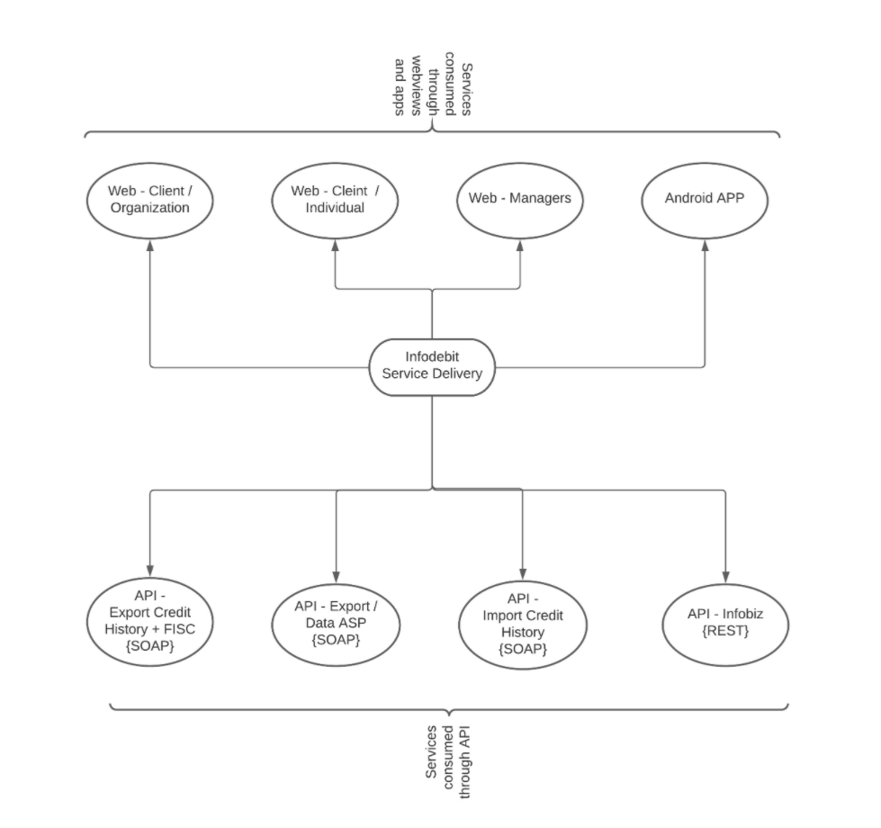

**Table of content**

- [1. INTRODUCERE](#1-introducere)
- [2. Utilizatori si Serviciile applicatiei](#2-utilizatori-si-serviciile-applicatiei)
  - [2.1. Utilizatorii paginilor web :](#21-utilizatorii-paginilor-web-)
  - [2.2. Utilizatorii applicatiei Android :](#22-utilizatorii-applicatiei-android-)
  - [2.3. Utilizatorii Webserviciilor :](#23-utilizatorii-webserviciilor-)
- [3. Dependenta de servicii externe (Furnizori) :](#3-dependenta-de-servicii-externe-furnizori-)
- [4. Dependenta clientilor de serviciile infodebit (Beneficiari) :](#4-dependenta-clientilor-de-serviciile-infodebit-beneficiari-)

## 1. INTRODUCERE

 

> *Biroul Istoriilor de Credit Infodebi* in continuare (***BIC INFODEBIT***) reprezinta o baza unica de date, care acumuleaza informatia de la Banci, Organizatii de Creditare Nebancare (***OCN***), Utilitati, Companii de Telecomunicatii etc., cu privire la creditele acordate persoanelor fizice / juridice si stocarea istoricul acestora.

 

> ***Clientii*** interesati de Istoricul Creditar a subiectului de credit sunt institutiile financiare ce doresc sa gestioneze riscurile de default a creditelor acordate. Prin urmare clientii apeleaza la serviciile infodebit pentru a verifica clientul sau inainte de a eliberarea creditului.

## 2. Utilizatori si Serviciile applicatiei

 

> Applicatia infodebit este exploatata de utilizatori prin intermediul :
> 1. Paginilor web
> 2. Aplicatie android
> 3. WebServicii 

 

### 2.1. Utilizatorii paginilor web :

 

1. **[Web Client / Organization](/ref_doc/WebClientOrg.md)** - Organizatiile ce au semnat contract de prestare servicii cu compania infodebit. Acest tip de client declara lista utilizatorilor (identificarea dupa IDNP) autorizati carora trebuie sa le oferim acces la sistem.
Dupa acordarea accesului, utilizatorii utilizeaza semnatura electronica sau mobila pentru autentificarea in sistemul infodebit.

 

2. **[Web Client / Individuals](/ref_doc\WebClientIndividuals.md)** - Reprezinta persoanele fizice ce doresc sa se logheze in cabinetul personal in baza semnaturii mobile sau electronice, pentru verificarea raportului personal.

 

3. **[Web Client / Managers](/ref_doc/WebManagers.md)** - Reprezinta angajatii Infodebit, ce utilizeaza panoul administrativ (vizionarea rapoarte, oferirea accesului, crearea utilizatorilor, etc.)

 

> Web Client/Manager, Web Client/Organization, Web Client/Individuals - toate sunt medii diferite de consumarea serviciului si trebuie despartite. La momenul actual ele se afla pe acelasi domen.

 

### 2.2. Utilizatorii applicatiei Android :

 

- Applicatia Android este destinata utilizatorilor (Client / Individuls) - persoanele fizice ce doresc sa se logheze in cabinetul personal in baza semnaturii mobile sau electronice, pentru verificarea raportului personal.
- Applicatia Android utilizeaza webserviciile pentru solicitarea informatia de la applicatia infodebit.

 

### 2.3. Utilizatorii Webserviciilor : 

- Utilizatorii Webserviciile sunt (Client / Organizations) - clientii ce au incheiate contract de prestari servicii cu compania infodebit.
- Utilizatorii dati utilizeaza webserviciile pentru integrarea produsului infodebit in applicatia proprie.

 

 

## 3. Dependenta de servicii externe (Furnizori) : 

 

1. **API Serviciul Fiscal de Stat** - Se solicita informatii cu privire la veniturile persoanei fizice. Solicitarile se efectueaza in baza IDNP-ului persoane fizice, Consintamintul Persoanei, Temeiul Legal de verificare. Serviciul impune limita de 4500 de requesturi pe zi. Achitarea serviciul merge pe baza unui abonament, taxa unica. ***Apelarea serviciului are loc printr-un canal securizat VPN***.

 

2. **API Agemtia Servicii Publice** - se obtine informatia oficiala de la agentia servicii publice cu privire la date personale a persoanelor fizice si juridice. Sunt consumate 8 metode (GetPerson, GetDriver, GetVehicleList, GetRealEstate, GetDebts, GetIncomes, GetPhoto, GetOrganization), taxarea serviciului are loc on request. ***Apelarea serviciului are loc printr-un canal securizat VPN***.

 

3. **API OTP sms** - serviciul de transmitere a parolelor OTP prin intermediul sms pe teritoriul Republicii Moldova, taxarea serviciului are loc on request. **Conetarea serviciului nu necesita VPN, are loc doar in baza IP adreselor.**

 

4. **API serviciul MPASS** - serviciul de implimentarea a platformei **MPASS** utilizata pentru autorizarea clientilor (client organization) si (client individuals). ***Conectarea are loc prin intermediul canalelor securizate VPN***

 

5. **API serviciul FICO (to be integrated)** - Integrarea serviciului FICO, urmeaza a fi integrat.

 

## 4. Dependenta clientilor de serviciile infodebit (Beneficiari) :

 

1. **API Import-ul Istoriei Creditare** - clientii (Banci, OCN, Telecomunicatii, etc) importa/actualizeaza istorica credtara persoanelor fizice / juridice.

 

2. **API Export-ul Istoriei Creditare** - clientii (Banci, OCN, Telecomunicatii, etc) exporta din infodebit zilnic informatia despre istoria creditara. API-ul dat este dependent de serviciul *API Serviciul Fiscal de Stat* , include ca informatie suplimentara la istoria creditara (on request).

 

3. **API Agentia Servicii Publice (from Infodebit)** - suntem intermediari al acestui serviciu si clientii sunt dependeti de acest serviciu.

 

4. **API Infobiz** - informtia descarcata si importata in baza de date de pe pagina [date.gov.md](https://date.gov.md/), *la momentul actual api-ul data nu este bine dezvoltat si utilizeaza numai un client*

 

5. **API Rapoarte Financiare -- (to be created)** - o sa cream un API pentru livrarea informatiei de la Biroul National de Statistica

 

6. **API Scoring Persoane Juridice -- (to be created)** - o sa cream un API pentru livrarea informatiei cu privire la serviciul de scoring pentru persoane juridice (este dependenta de informatia de la BNS, Agentia Servicii Publice GetOrganization, Informatii de pe [date.gov.md](https://date.gov.md/) ).
