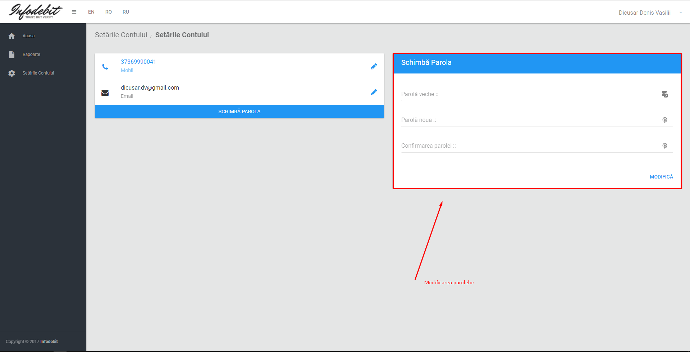

# Cabinetul utilizatorilor "Client Individuals"

- [Cabinetul utilizatorilor "Client Individuals"](#cabinetul-utilizatorilor-client-individuals)
  - [Logarea in Cabinetul Personal.](#logarea-in-cabinetul-personal)
  - [Functinalitati ale Cabinetului Personal](#functinalitati-ale-cabinetului-personal)

**[GO BACK TO HOMEPAGE](../README.md)**

- Clientii (Individuals) - utilizeaza autentificarea securizata a platformei [MPASS](https://mpass.gov.md/), care la rindul sau se logheaza cu [semnatura-mobila][1] sau cu [semnatura electronica][2].

- Autentificarea prin intermediul platformei MPASS este utilizata pentru identificarea persoanei la distanta.
- La prima logare cu semnatura electronica sau mobila utilizatorului i se va propune indeplinirea anchetei pentru crearea contului. Posibilitatea de crearea a contului se acorda clientului pentru scutirea utilizatorului de costuri aditionale la logarile cu semnatura electronica.
- Dupa crearea contului clientul are posibilitate de logare atit prin semntaura electronica sau mobila, cit si cu utilizarea credentialelor personale.

## Logarea in Cabinetul Personal.

 

1. Accesarea paginii <https://bic.infodebit.md/access_cabinet.php>. 
2. Click pe butonul **"Autentficare MPASS"**. 
3. Selectarea metodei de semnare **"Semnatura Mobila"**. 
4. Confirmarea semnaturii prin intermediul telefonului mobil.  
5. Selectarea **"Cabinet Personal"**. 

 

## Functinalitati ale Cabinetului Personal

 

1. Logarea cu succes -> apasam butonul "Obtine Raportul" 

 

2. Raportul Istoriei de Credit se genereaza. 

 

3. Posbilitatea de vizualizarea raportelor anterior generate. 

 

4. Rubrica setari permite modificarea datelor personal.

   1.  Telefon : 
   2.  Email : 
   3.  Parola : 

 

> Ulterior planificam ca utilizatorul sa aiba posibilitatea de a modifica si datele personale gen (Nume, Prenume, Adrese, Profesie, si alte date generale ...).

[1]:  "semnatura mobila"
[2]:  "semnatura electronica"
