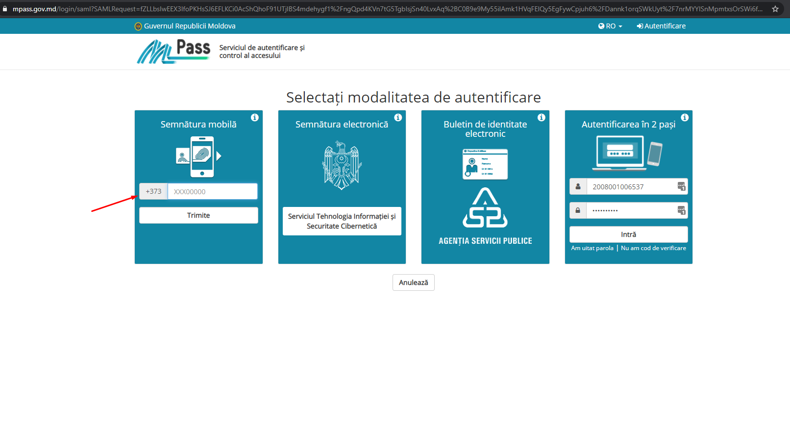

# Pagina utilizatorilor "Client Organization"

Clientii (Organizatiile) - utilizeaza autentificarea securizata a platformei [MPASS](https://mpass.gov.md/), care la rindul sau se logheaza cu [semnatura-mobila][1] sau cu [semnatura electronica][2].

1. Accesarea paginii <https://bic.infodebit.md/access_cabinet.php>. 
2. Click pe butonul **"Autentficare MPASS"**. 
3. Selectarea metodei de semnare **"Semnatura Mobila"**. 
4. Confirmarea semnaturii prin intermediul telefonului mobil.  
5. Selectarea cabinetul clientului (Optiunea data apare doar in cazul cind idnp-ul persoanei fizice este afiliat la un contract activ incheiat cu un client). 
6. Logarea cu succes in cabinetul clientului , este reprezentat utilizatorul si numele companiei din care activeaza. 

[1]:  "semnatura mobila"
[2]:  "semnatura electronica"